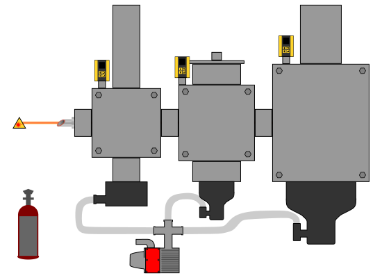
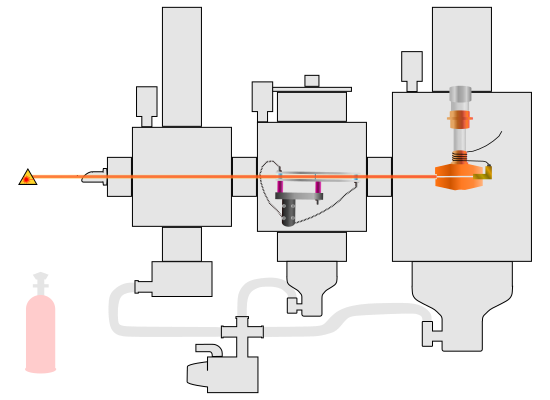

# Virtual-Instrument-Diagrams

This repository is the home of the different diagrams used in the construction of our virtual instruments!

- [Inkscape Learning Resources](https://github.com/RastonLab/Virtual-Instruments/wiki/Web-Developer-Tools#inkscape)

## [FTIR](ftir#readme)

### Exterior

## [HeNDI](#readme)

### Exterior

### Interior

## Logo

