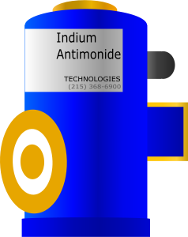
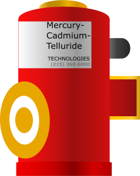
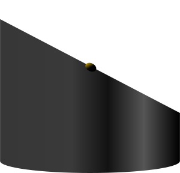
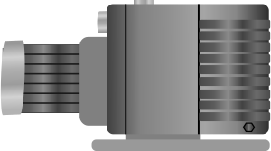
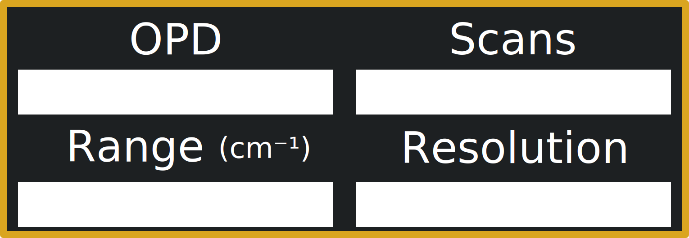

# FTIR (Fourier Transform InfraRed)

## [Instrument Window](instrument-window.svg)

## Tooltip Images

### [APD](tooltips/apd.svg)

### [Aperture Wheel](tooltips/aperture-wheel.svg)

### [Beamsplitter (CaF2)](tooltips/beamsplitter-caf2.svg)

### [Beamsplitter (ZnSe)](tooltips/beamsplitter-znse.svg)

### [Corner Cube (both fixed and moveable)](tooltips/corner-cube.svg)

### [Flat Mirror (both fixed and rotatable)](tooltips/flat-mirror.svg)

### [Globar](tooltips/globar.svg)

### [InSb](tooltips/insb.svg)

### [Laser](tooltips/laser.svg)

### [Lecture](tooltips/lecture.svg)

### [Manometer](tooltips/manometer.svg)

### [MCT](tooltips/mct.svg)

### [Parabolic Mirror](tooltips/parabolic-mirror.svg)

### [Parabolic Mirror w/ Hole](tooltips/parabolic-mirror-hole.svg)

### [Rotary Pump](tooltips/pump.svg)

### [Sample Cell (CaF2)](tooltips/sample-cell-caf2.svg)

### [Sample Cell (ZnSe)](tooltips/sample-cell-znse.svg)

### [Tungsten](tooltips/tungsten.svg)

## Template Images

### [Beamsplitter (CaF2)](templates/beamsplitter-caf2.svg)

### [Beamsplitter (ZnSe)](templates/beamsplitter-znse.svg)

### [Corner Cube (both fixed and moveable)](templates/corner-cube.svg)

### [Display](templates/display.svg)

### [Flat Mirror (both fixed and rotatable)](templates/flat-mirror.svg)

### [Hose 1 (sample cell to rotary pump)](templates/hose-1.svg)

### [Hose 2 (sample cell to lecture bottle)](templates/hose-2.svg)

### [Information Icon](templates/information.svg)

Icon is adapted from the Wikimedia Commons (Licensed [CC BY-SA 4.0](https://commons.wikimedia.org/wiki/File:Infobox_info_icon.svg)). The only change made to the icon was adding a grey background so that the user cannot click through the original transparent background.

### [Readout](templates/readout.svg)

### [Sample and Detector Compartment](templates/sample-detector-compartment.svg)

### [Source Compartment](templates/source-compartment.svg)

