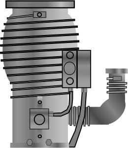
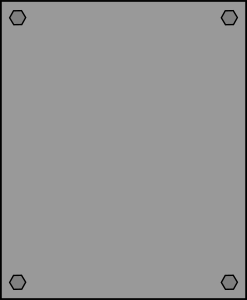

# HeNDI (Helium NanoDroplet Isolation)

## Main Instrument Windows

### [Exterior](hendi-exterior.svg)

### [Interior]()

## Tooltip Images

### [Chamber](tooltips/chamber.svg)

### [Coldhead](tooltips/coldhead.svg)

### [Diffusion Pump](tooltips/diffusion-pump.svg)

### [Ion Gauge](tooltips/ion-gauge.svg)

### [Laser Symbol](tooltips/laser.svg)

### [Lecture Bottle](tooltips/lecture.svg)

### [Rotary Pump](tooltips/rotary-pump.svg)

### [Salt Window](tooltips/salt.svg)

### [Source Chamber](tooltips/source-chamber.svg)

### [Stark](tooltips/stark.svg)

### [Turbo Pump](tooltips/turbo-pump.svg)

